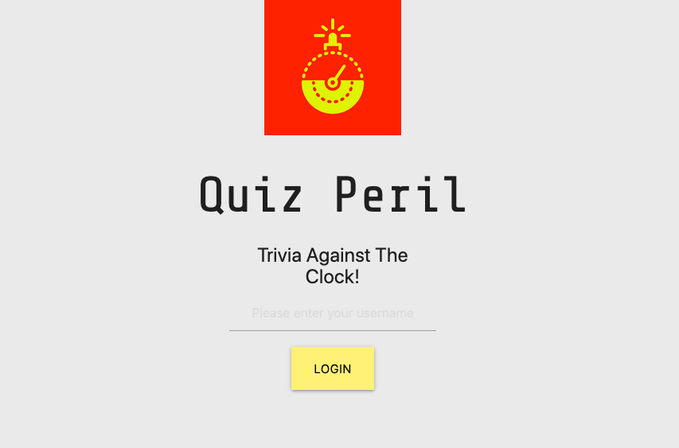
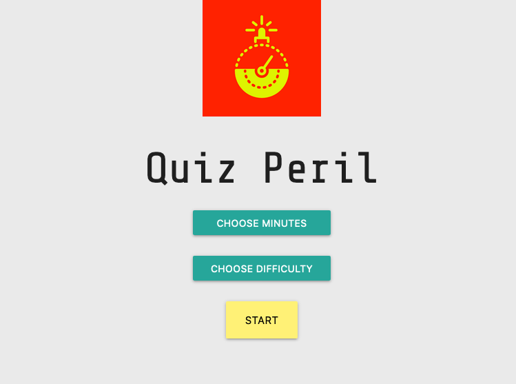
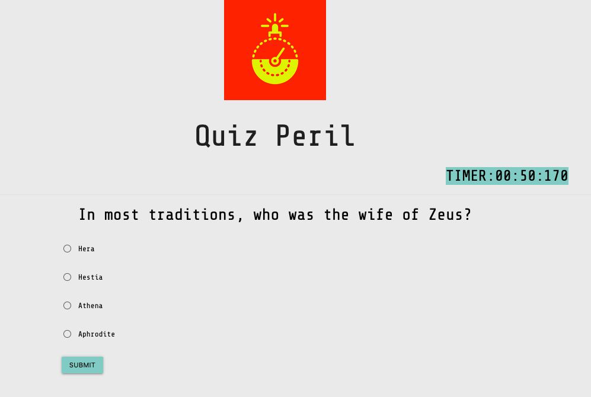
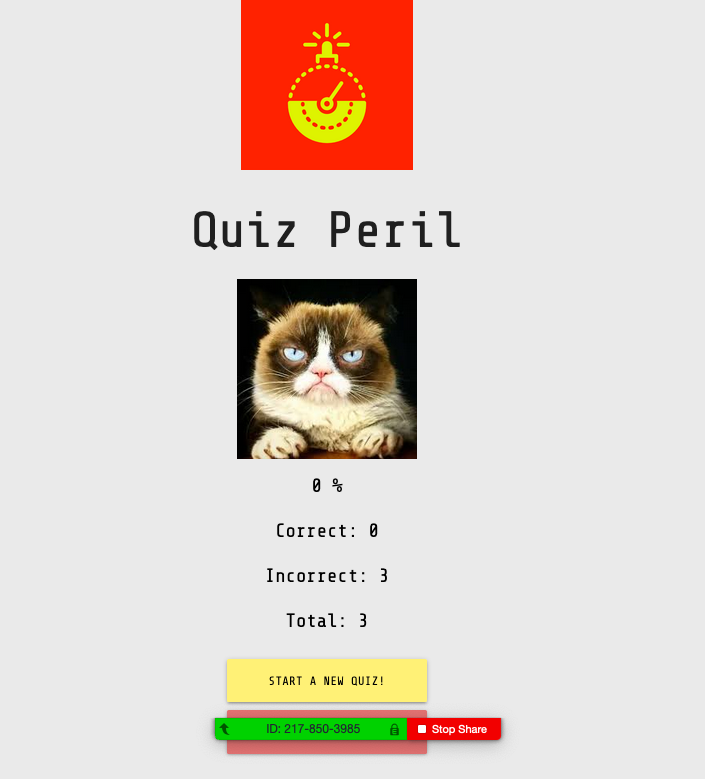

# quizperil

Trivia Against The Clock!

## Description

A timed trivia application using the [Open Trivia Database](https://opentdb.com) to generate questions.

## Screenshots

### Login

### Selection

### Question

### Results

## Technologies Used

- Ruby on Rails API backend
- Vanilla Javascript frontend
- Materialize CSS
- OpenTDB API

## Features

- Login via username (persisted to database)
- Select timer interval and question difficulty
- Answer as many questions as possible in given interval!
- View quiz results and logout or retake another quiz
- Quiz results and questions are persisted to database for later metrics

## Installation and Usage

This project requires rails to be installed on the client system. After cloning/downloading the project folder, cd into `quizperil_backend\` and run `rails db:migrate`, `rails db:seed`, and finally: `rails s` to start the backend server. After it's up and running, cd into `quizperil_frontend\` and open `index.html` in your favorite browser. Enjoy!
